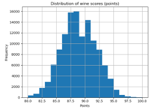
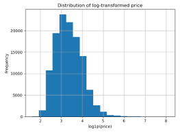
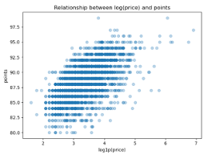
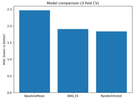
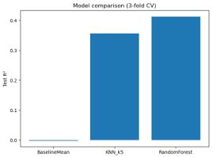
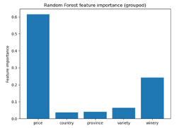

# Wine Score Prediction & Pricing Analytics 🍷

> Predicting expert wine scores from structured metadata using KNN and Random Forest — a 130K-record machine learning study with direct pricing strategy implications.

[](https://catalog.northeastern.edu/)
[](#-tech-stack)
[](https://www.kaggle.com/datasets/zynicide/wine-reviews)
[](#-methodology)
[](#-results)

---

## 💼 Business Problem

**Wine scores are not just ratings — they are critical economic drivers.**

Expert scores from publications like *WineEnthusiast* directly influence:
- 🏷️ **Pricing tiers** — higher scores justify premium pricing
- 🛒 **Shelf positioning** — retailers prioritize highly-rated wines
- 📊 **Demand forecasting** — consumers actively filter by score

### The Market Challenge

Retailers rely on these ratings to justify premium pricing, yet score variation is complex and often disconnected from transparent metadata. This creates a transparency gap between producers, retailers, and consumers.

### Critical Question

> *"Can we use structured metadata (price, winery, region, variety) to accurately predict and validate expert quality scores?"*

If yes, this enables:
- 🎯 Pre-launch pricing recommendations for producers
- 💎 "Value-for-money" identification for consumers
- 📈 Inventory optimization for retailers

---

## 👤 My Role

This was a **2-person research project** (co-authored with Xiaoxin Lao) for INFO 6105 — Data Science Engineering Methods at Northeastern University. Both authors contributed equally to data preprocessing, model implementation, experimentation, and analysis. This repository represents my published version of our joint work, with my co-author's mutual agreement (Xiaoxin is publishing the work independently as well).

**My specific contributions included:**
- 🔬 Co-designed the experimental methodology (baseline + KNN + Random Forest comparison)
- 📊 Implemented preprocessing pipeline with log-transformed pricing and one-hot encoding for high-cardinality categorical features
- 📈 Built business case translation — turned the academic findings into a 3-slide executive case study
- ✍️ Co-authored the technical paper and prepared presentation materials

---

## 📊 Dataset Overview

**Source:** WineEnthusiast Wine Reviews (`winemag-data-130k-v2`)

| Property | Value |
|----------|-------|
| Total records (after filtering) | 120,975 |
| Target variable | `points` (expert score 80–100) |
| Numerical feature | `price` (USD) |
| Categorical features | `country`, `province`, `variety`, `winery` |
| Mean score | 88.42 ± 3.04 |
| Median price | $25.00 |
| Unique wineries | 15,855 (high-cardinality) |

### Data Distributions



*Most wines fall between 80–95 points, with a slight skew toward higher scores. Because this range is narrow, prediction errors of 2–3 points are meaningful.*



*Raw prices are heavily right-skewed; `log1p(price)` transformation produces a near-normal distribution suitable for distance-based models.*



*Clear positive trend between log-price and score, but substantial scatter suggests categorical attributes (region, variety, winery) provide additional signal beyond price alone.*

---

## 🔬 Methodology

### Preprocessing Pipeline (scikit-learn `Pipeline` + `ColumnTransformer`)

| Step | Treatment |
|------|-----------|
| **Missing values** | Rows missing `points` or `price` removed; categoricals imputed with mode |
| **Price** | `log1p` transformation + `StandardScaler` (for KNN distance metric) |
| **Categoricals** | `OneHotEncoder(handle_unknown="ignore")` for unseen values at inference |

The same pipeline is shared across all models to ensure **fair comparison**.

### Model Comparison

Three models of increasing complexity:

| Model | Purpose | Key hyperparameters |
|-------|---------|--------------------|
| **DummyRegressor (mean)** | Lower-bound baseline | `strategy="mean"` |
| **KNN Regressor** | Non-parametric local model | `n_neighbors=5`, uniform weights |
| **Random Forest** | Non-linear ensemble | `n_estimators=50`, `max_depth=12` |

### Evaluation

- **3-fold cross-validation** with shuffled splits and fixed `random_state=42`
- **Random subsample of 10,000 wines** for computational tractability
- **Metrics:** MAE, RMSE, R² — reported as mean across folds

---

## 📈 Results

### Model Performance (3-Fold Cross-Validation)

| Model | MAE | RMSE | R² |
|-------|----:|-----:|---:|
| Baseline (mean) | 2.48 | 3.02 | 0.00 |
| KNN (k=5) | 1.91 | 2.42 | 0.36 |
| **Random Forest** | **1.84** | **2.32** | **0.41** |





### Key Takeaway

> **The Random Forest model explains >40% of score variance using structured features alone** — without relying on textual review content.

This is meaningful because:
- Demonstrates substantial predictive signal from basic metadata
- Establishes a transparent baseline for pricing decisions
- The honest R² ceiling (0.41) reflects domain reality: critic ratings are inherently subjective and influenced by unmeasured factors (vintage, tasting notes, winemaking technique)

---

## 💡 Feature Importance — From Data to Decision



| Feature | Importance | Business Interpretation |
|---------|:----------:|------------------------|
| **Price** | 62% | Strongest predictor — price-quality correlation is real in the market |
| **Winery** | 24% | Brand reputation significantly impacts scores |
| **Variety** | ~6% | Grape type matters, but secondarily |
| **Region** (Province + Country) | ~7% | Regional effects exist but weaker than producer identity |

### Three Actionable Insights

#### 🎯 1. Core Insight — Price Reflects Quality
The strong price-score correlation (62% feature importance) suggests that market pricing is **broadly aligned** with expert quality assessment. This validates price as a meaningful quality signal for consumers.

#### 🏛️ 2. Market Perception — Brand Matters
Winery contributes 24% of predictive power. **Producer identity is the second-strongest signal** — reputation and consistency outweigh region for established wineries.

#### 📊 3. Strategic Action — Inventory & Positioning
For retailers and analysts:
- **High-priced + reputable winery** → premium shelf placement
- **Mid-priced + reputable winery** → "hidden value" recommendations
- **Low-priced + lesser-known winery** → strong indicator that quality validation is needed before stocking

---

## 🛠️ Tech Stack

```
Language:       Python 3.x
ML Framework:   scikit-learn (Pipeline, ColumnTransformer)
Data:           pandas, numpy
Visualization:  matplotlib
Models:         DummyRegressor, KNeighborsRegressor, RandomForestRegressor
Evaluation:     KFold, cross_validate
```

---

## 📚 Project Artifacts

| Artifact | Description |
|----------|-------------|
| 📓 [Jupyter Notebook](notebooks/wine_quality_analysis.ipynb) | Complete reproducible analysis pipeline |
| 📄 [Technical Paper (PDF)](docs/technical_report.pdf) | 6-page academic write-up (NeurIPS-style format) |
| 💼 [Business Case Study (PDF)](docs/business_case.pdf) | 3-slide executive summary translating findings into pricing strategy |

---

## 🚀 Future Work

The current model establishes a solid baseline, but several extensions could deepen the analysis:

| Direction | Rationale |
|-----------|-----------|
| **Time-ordered cross-validation** | Train on earlier vintages, test on later ones — closer to real-world deployment |
| **Segment-specific models** | Separate models for budget / mid-range / premium tiers may surface segment-specific patterns |
| **Uncertainty quantification** | Quantile regression forests to output prediction intervals, not just point estimates |
| **NLP feature integration** | Incorporate review text via BERT/embedding features to push beyond the R² 0.41 ceiling |
| **Cross-publication validation** | Test on Vivino, Robert Parker, or Decanter datasets to assess generalization |

---

## 🎓 What This Project Demonstrates

For prospective employers, this project showcases:

- ✅ **End-to-end ML pipeline design** — preprocessing, modeling, evaluation in one cohesive flow
- ✅ **Methodological rigor** — proper baselines, cross-validation, fair comparison
- ✅ **Honest reporting** — R² of 0.41 with clear discussion of limitations, not inflated claims
- ✅ **Business translation** — academic findings rendered as executive-ready case study
- ✅ **Iteration on feedback** — explicit improvements over mid-term version based on professor input
- ✅ **Domain reasoning** — feature importances connected to real business decisions

---

## 📋 Context

**Course:** INFO 6105 — Data Science Engineering Methods  
**Institution:** Northeastern University, College of Engineering  
**Term:** Fall 2025  
**Final Grade:** A

---

## 📫 Contact

📧 **Email:** wu.re@northeastern.edu  
💼 **LinkedIn:** [linkedin.com/in/renna-wu](https://linkedin.com/in/renna-wu)  
💻 **GitHub:** [github.com/RennaWu](https://github.com/RennaWu)

---

<sub>This repository represents my published version of a 2-person research project co-authored with Xiaoxin Lao. Both authors contributed equally and have mutually agreed to publish this work independently as part of our respective portfolios.</sub>
